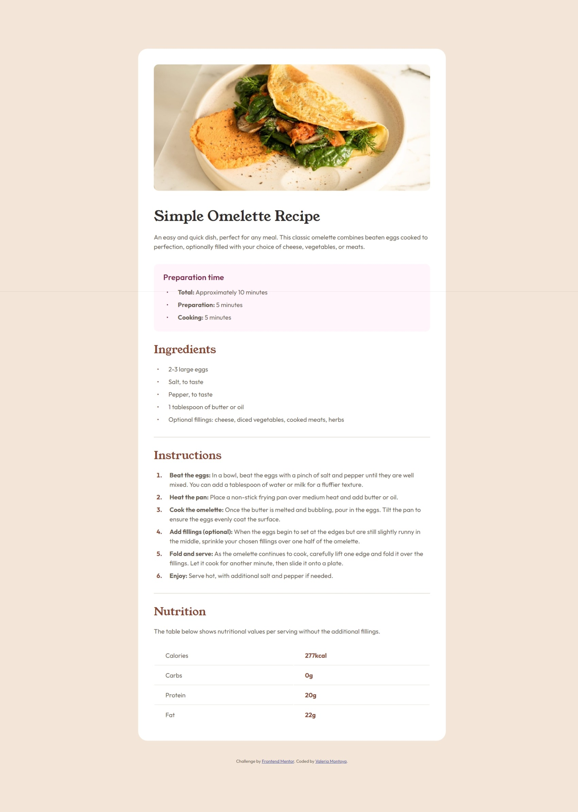

# Frontend Mentor - Recipe page solution

This is a solution to the [Recipe page challenge on Frontend Mentor](https://www.frontendmentor.io/challenges/recipe-page-KiTsR8QQKm). Frontend Mentor challenges help you improve your coding skills by building realistic projects.

## Table of contents

- [Overview](#overview)
  - [Screenshot](#screenshot)
  - [Links](#links)
- [My process](#my-process)
  - [Built with](#built-with)
  - [What I learned](#what-i-learned)
- [Author](#author)

## Overview

### Screenshot



### Links

- Solution URL: [Frontend Mentor](https://www.frontendmentor.io/challenges/recipe-page-KiTsR8QQKm)
- Live Site URL: [GitHub Pages](https://valeriamontoya.github.io/recipe-page/)

## My process

### Built with

- Semantic HTML5 markup
- CSS custom properties
- Flexbox
- Mobile-first workflow

### What I learned

By doing this challenge I practiced HTML and CSS fundamentals. Flexbox was an important tool to complete the project easily and mobile-first workflow was perfect to get the project done really fast.

Something I learned during the process is how to import font files without using Google Fonts links. Here's what I did:

```css
@font-face {
  font-family: "Young Serif";
  src: url("../assets/fonts/young-serif/YoungSerif-Regular.ttf") format("truetype");
  font-weight: 400;
}

@font-face {
  font-family: "Outfit";
  src: url("../assets/fonts/outfit/Outfit-VariableFont_wght.ttf") format("truetype");
  font-weight: 400, 600, 700;
}
```

## Author

- Frontend Mentor - [@ValeriaMontoya](https://www.frontendmentor.io/profile/ValeriaMontoya)
- Twitter - [@vale_smf](https://twitter.com/vale_smf)
